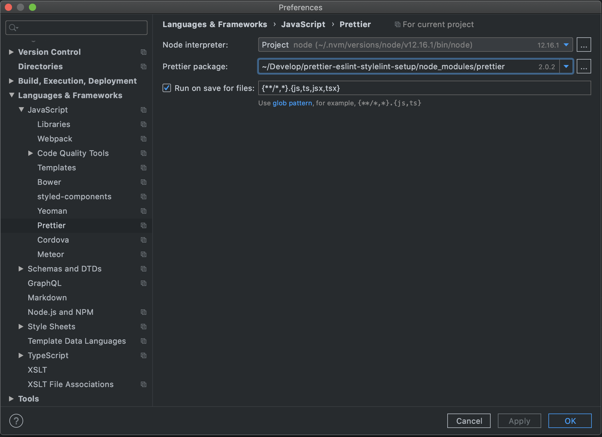
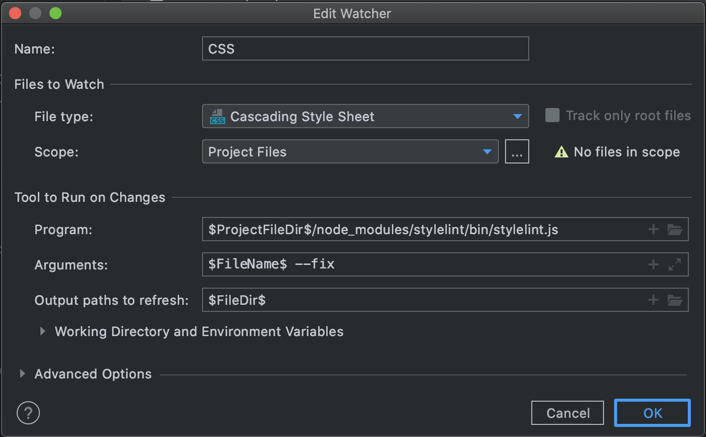
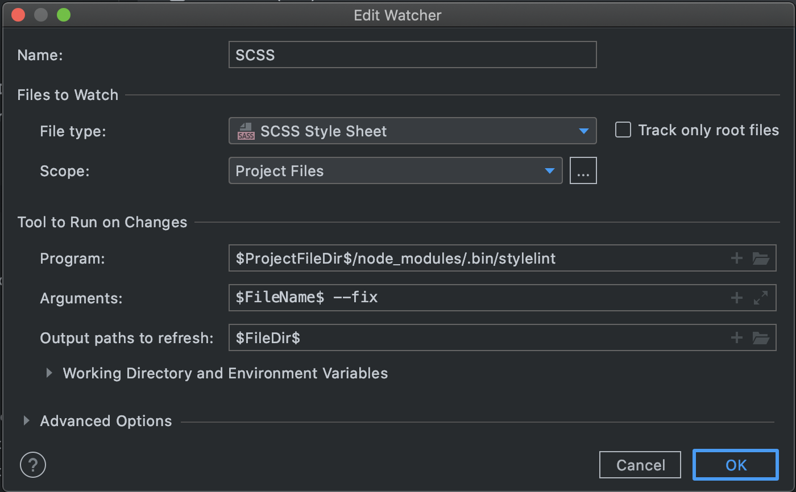

# 0. Configuration files

Each "plugin" has a individual configuration file. You find it in the root of this repository.

| Plugin    | Config                        |
| --------- | ----------------------------- |
| ESLint    | .eslintrc                     |
| Prettier  | .prettierrc & .prettierignore |
| Stylelint | .stylelintrc                  |

# 1. Install dependencies

Install prettier, eslint and stylelint

```
npm i -DE prettier eslint eslint-config-prettier eslint-plugin-prettier stylelint stylelint-config-prettier stylelint-declaration-use-variable stylelint-order stylelint-prettier stylelint-scss @pro-vision/stylelint-config-pv
```

# 2. VSCode setup

### Necessary VSCode plugins

- [ESLint](https://marketplace.visualstudio.com/items?itemName=dbaeumer.vscode-eslint)
- [Prettier - Code formatter](https://marketplace.visualstudio.com/items?itemName=esbenp.prettier-vscode)
- [stylelint](https://marketplace.visualstudio.com/items?itemName=stylelint.vscode-stylelint)

### VSCode configuration settings

```
...
"editor.codeActionsOnSave": {
  "source.fixAll": true,
},
"editor.defaultFormatter": "esbenp.prettier-vscode",
"editor.formatOnPaste": true,
"editor.formatOnSave": true,
"editor.formatOnType": true,
"eslint.format.enable": true,
...
```

# 3. Webstorm setup

### Prettier Settings

- **Goto:** _Languages & Frameworks > Javascript > Prettier_
  - Check the _Run on save for files_ checkbox
  - set the value to: `{**/*,*}.{js,ts,jsx,tsx}`
    

### Stylelint Settings

I could only manage to enable autofix for css/scss files using File Watchers.

- **Goto:** _Tools > File Watchers_
  - Add new file watcher for CSS with the following settins:
    
  - Add new file watcher for CSS with the following settins:
    
